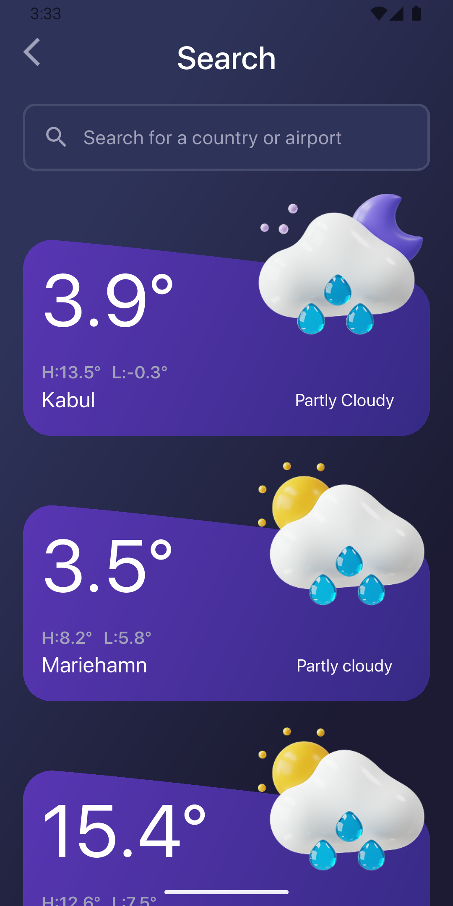
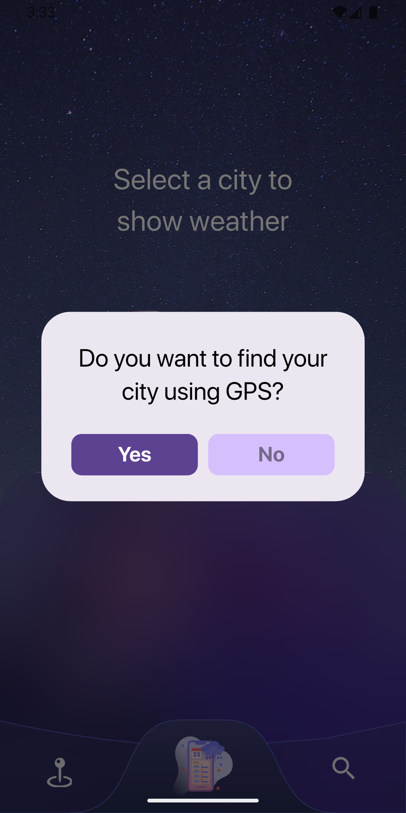

# Weatherify ⛅

A modern, feature-rich weather application built with Flutter that delivers real-time weather information with an intuitive and beautiful user interface.

[](https://www.linkedin.com/feed/update/urn:li:activity:7368987414167478272/?originTrackingId=UMyGVQnCTcm9eFcLUQt%2B5A%3D%3D)

## 📖 About

Weatherify is a sleek weather application that combines clean design with powerful functionality to put essential weather data right at your fingertips. Developed as a practical project to master Flutter concepts, this app showcases modern mobile development practices with a focus on user experience and privacy-first approach. Built in 31.4 hours, Weatherify demonstrates efficient implementation of location services, state management, and real-time data handling.

## ✨ Features

### Weather Information
- **Comprehensive Weather Display** - Beautiful home screen showing detailed weather information including temperature, humidity, wind speed, and conditions
- **Real-time Updates** - Live weather data synchronized with current conditions
- **Multi-day Forecast** - Extended weather predictions for better planning

### Location Services
- **GPS-Powered Detection** - Automatic location detection using device positioning
- **Privacy-First Approach** - User confirmation dialog before accessing location data
- **Location-Based Updates** - Seamless weather updates based on your current position

### Search & Navigation
- **City Search** - Smart search functionality to explore weather conditions worldwide
- **Intuitive Navigation** - User-friendly bottom navigation for effortless app exploration
- **Quick Access** - Bottom sheet interface for rapid information access

### User Experience
- **Clean Modern Design** - Sleek interface with attention to detail
- **Smooth Animations** - Polished transitions and interactions
- **Responsive Layout** - Optimized for different screen sizes

## 🛠️ Tech Stack

- **Framework:** Flutter
- **State Management:** BLoC Pattern
- **Architecture:** Feature-based
- **Networking:** Dio
- **Location Services:** Geolocator & Geocoding
- **Platforms:** iOS & Android

## 📦 Dependencies

```yaml
dependencies:
  dio: ^5.8.0+1
  flutter_bloc: ^9.1.1
  geocoding: ^4.0.0
  geolocator: ^14.0.2
  intl: ^0.20.2
  permission_handler: ^12.0.1
```

### Key Packages
- **dio** - Efficient HTTP client for API calls
- **flutter_bloc** - Robust state management using BLoC pattern
- **geolocator** - Precise device location positioning
- **geocoding** - Convert coordinates to addresses and vice versa
- **intl** - Proper date/time formatting and internationalization
- **permission_handler** - Secure location access management

## 📁 Project Structure

The project follows a feature-based architecture for maintainability and scalability:

```
lib/
├── home/
│   ├── views/
│   ├── widgets/
│   ├── models/
│   ├── helper/
│   └── services/
├── search/
└── ... (other features)
```

## 📸 Screenshots

<p align="center">
  
  
  
</p>

<p align="center">
  
  
</p>

## 🚀 Getting Started

### Prerequisites

- Flutter SDK (latest stable version)
- Android Studio / VS Code with Flutter extensions
- iOS Simulator (for macOS) or Android Emulator
- Weather API key (OpenWeatherMap or similar)

## 🔑 Permissions

The app requires the following permissions:
- **Location** - To provide weather data for your current location
- **Internet** - To fetch real-time weather information

All permissions are requested with user consent and can be managed in device settings.

## 🏗️ Architecture

Weatherify implements the BLoC (Business Logic Component) pattern for state management, ensuring:
- Clear separation of concerns
- Testable business logic
- Predictable state changes
- Scalable codebase

The feature-based structure organizes code by functionality, making it easier to navigate, maintain, and extend.

## 👨‍💻 Development

This project was developed solo as a practical application to master Flutter concepts and modern mobile development practices.

### Development Stats
- **Duration:** ~31.4 hours
- **Contributors:** 1 (Solo project)
- **Purpose:** Learning project to implement Flutter concepts
- **Status:** Complete and functional

## 🎯 Learning Outcomes

This project helped solidify understanding of:
- BLoC state management pattern
- Location services integration
- API communication and data handling
- Permission management
- Modern Flutter UI/UX practices
- Feature-based architecture

---

**Note:** This project was created as a learning exercise to practice and implement various Flutter concepts and development patterns.
